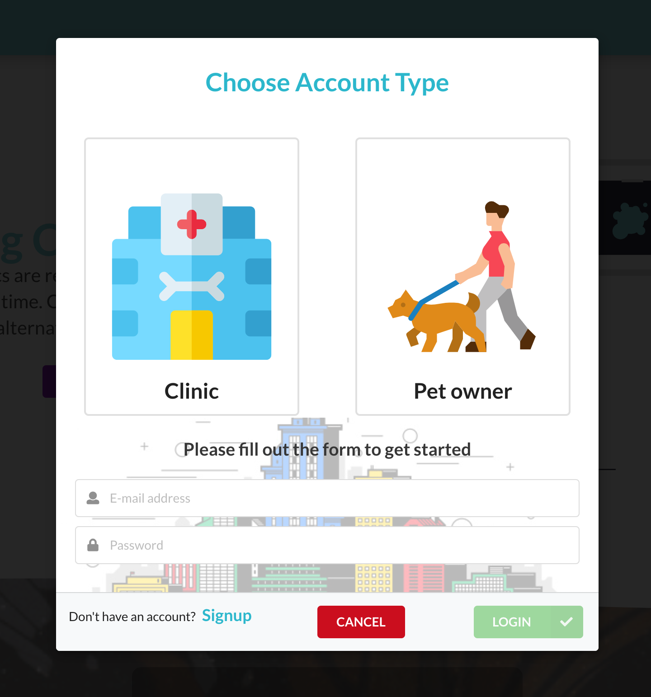
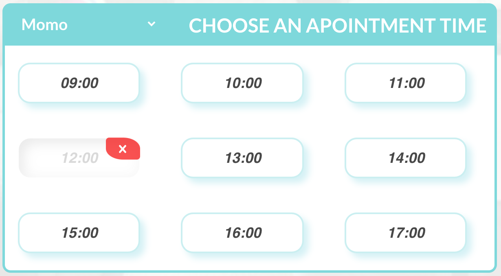
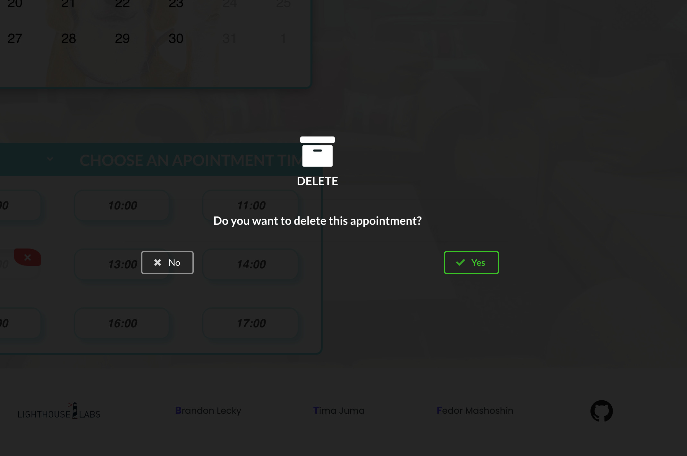
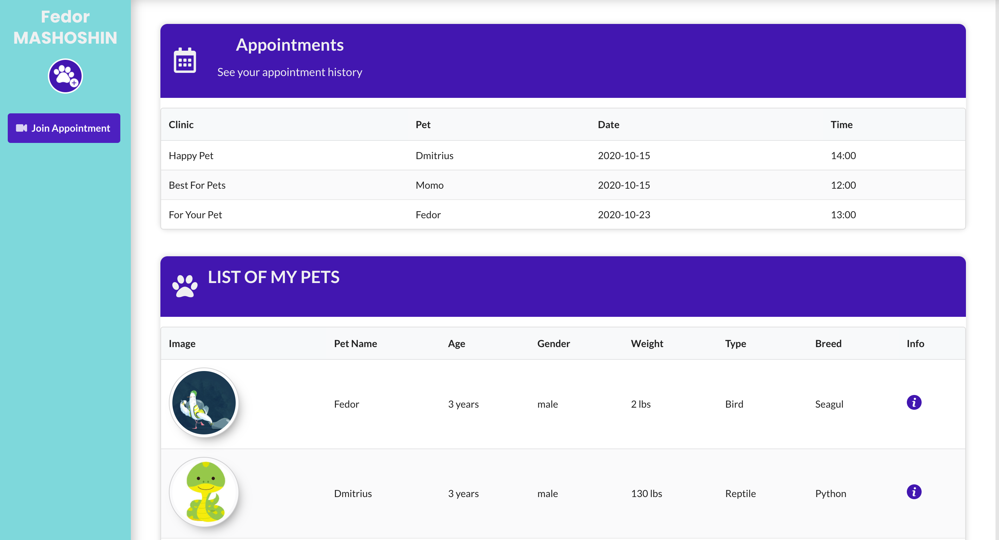

# Virtual Vet Application (aka PawBulance)

In the post pandemical world our App helps to connect Vet clinics and patients(pets).  
Within this App you can register whether as ✅ pet owner (client) or as ✅ clinic (doctor).  
Each account has its own dasboard containing information about pets and appointments.

## ▶️ Clone this repo and run:

### `npm start`

Runs the app in the development mode.
Open [http://localhost:3000](http://localhost:3000) to view it in the browser.

# Features of our App:

## Logging in with client account. ⬇️

1.  Searching for vet clinic by:

- Clinic name
- Location
- By pet type

2. Book an appointment with any clinic.
   

3. Delete an appointment if needed.
   
   

4. Chat, built with Web Sockets.
   

5. View all your appointments in user-dashboard.
   

6. Adding new pet.
   

## Logging in with clinic account. ⬇️

1. All information can be found in the dasboard.
   

2. Video chat with patient.
   

# Homepage

- Login
- Register
- Search

# Register Page

- Register doctor
- Register patient

# Login

- User must be able to login
- Login by email
- password

# Paitient dashboard

- Upcoming appointment(s)
- Previous appointment(s)
- Create appointment button
- Appointment waiting room (Google hangouts link)
- Pet(s) info

# Clinic dashboard

- Upcoming appontment(s)
- Previous appointment(s)
- Calendar
- Search pets

# Pet info page

- Name
- Owner
- Age
- Type
- Breed
- Health conditions
- Doctor's note

# Patient calander page

- Show available/unvailabe
- Click to book (only if available)
- Modal to describe symptoms

# Search

- Doctor name
- Clinic name
- Pet type
- Location
- Rating

# Click on doctor

- Show doctor's calendar

# Doctor calendar page

- Show upcoming appointments
- Show names
- Doctor info (aside)

# Database

## Doctor

- Name
- email
- Pet types
- Clinic (VAR CHAR)

## Pet Types

- Title
- Doctor(s)

## Patient

- Name
- Address
- Phone
- email
- Pet(s)

## Pet

- Name
- Owner
- Age
- Type
- Breed
- Health conditions
- Doctor's note

## Appontment

- Patient (VAR CHAR)
- Pet (VAR CHAR)
- Symptopms (TEXT)
- Doctor (VAR CHAR)
